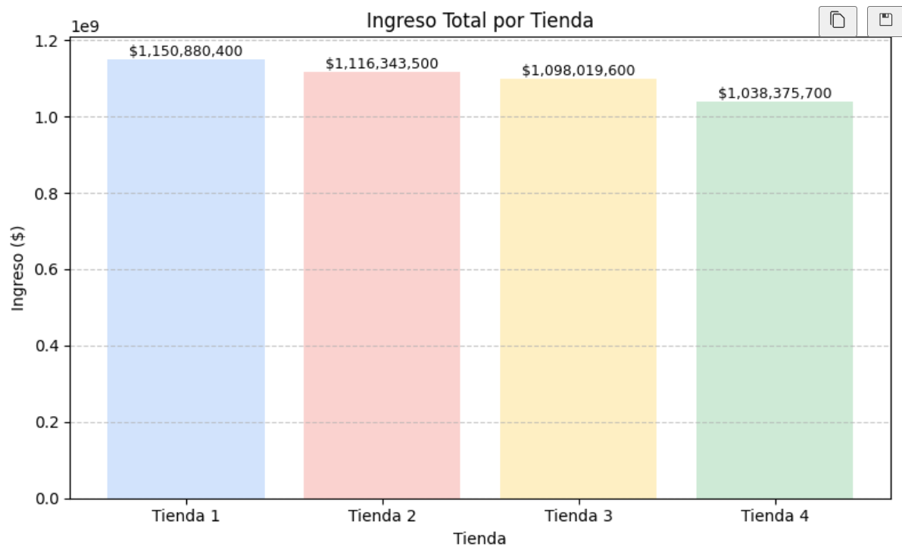
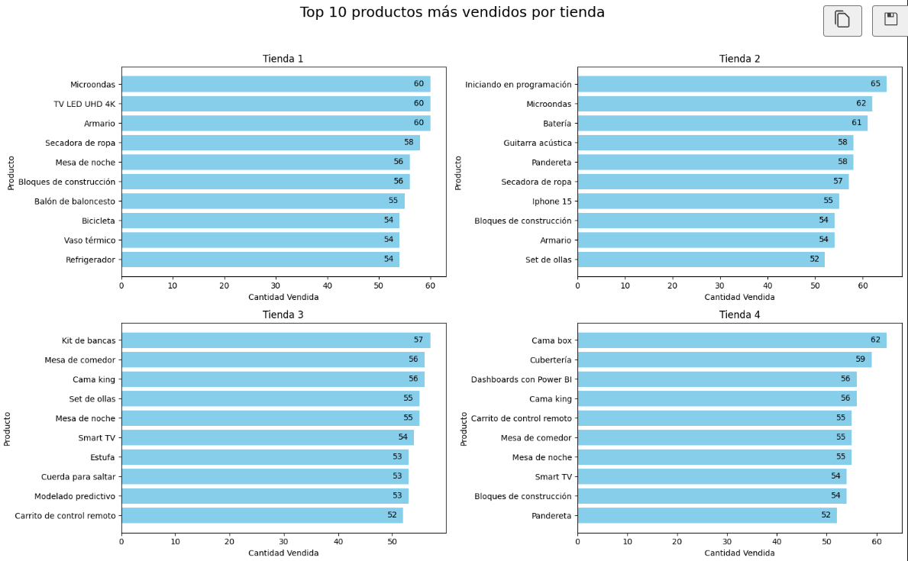
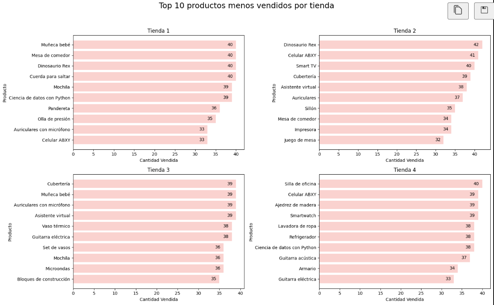
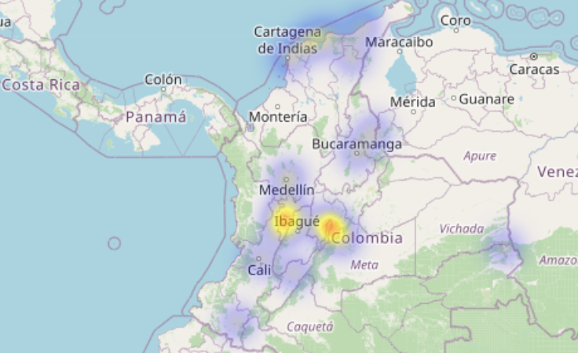

# 💼 Challenge: Alura Store

## 📝 Descripción del proyecto

Como parte de la formación *Fundamentos de Python y Datos* en la etapa de *Data Analysis* de Alura-Latam, se ha desarrollado este proyecto de análisis de datos **Alura Store** para completar el Challenge 1 de la formación.

El objetivo es aplicar las habilidades desarrolladas en la formación para realizar para resolver un caso, que consiste el análisis de datos sobre cuatro tiendas que posee el Sr. Juan y determinar, con base al análisis de los datos disponibles, cuál de ellas sería mas conveniente vender para financiar un nuevo emprendimientos.

---

## 📊 Metodología del análisis

El análisis se basó en el procesamiento de datos reales proporcionados por clientes. A partir de esta información, se generaron los siguientes indicadores clave:

- 💰 **Ingresos totales** por tienda
- 🚚 **Costo promedio de envío** por tienda
- 💰 **Ingresos netos** por tienda
- 📦 **Categorías de productos** más vendidas  
- ⭐ **Calificación promedio** de los clientes por tienda  

---

## 🧰 Herramientas utilizadas

- Python 🐍  
- Google Colab ♾️  
- Bibliotecas: `pandas`, `matplotlib`, `folium`  

---
## 🛠️ Tecnologías y Lenguajes Utilizados

- **Python 🐍**  
  Para el análisis de datos y la creación de visualizaciones.

- **Pandas 📊**  
  Manipulación y análisis de datos tabulares.

- **Matplotlib 📈**  
  Generación de gráficos y visualizaciones estadísticas.

- **Google Colab📓**  
  Entorno interactivo para desarrollar y documentar el análisis.

- **Git & GitHub 🔧**  
  Control de versiones y publicación del proyecto.
  
  ---

## 📈 Imágenes del proyecto

  ---

## 📈 Repositorio del Proyecto

Se Puede consultar el código del proyecto en el siguiente enlace:

🔗 [Repositorio del proyecto en GitHub](https://github.com/marozta/Data-Science-Challenge1-Alura-ONE-G9.git)

---